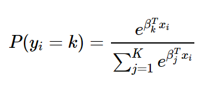

```{r setup, include=FALSE}
# Minimal setup
options(htmltools.dir.version = FALSE)
knitr::opts_chunk$set(echo = TRUE, message = FALSE, warning = FALSE)
library(tidyverse)
library(readr)
library(stringr)
```


# 1️⃣ Project Topic

**Project Title:**  
Building a Multi-Class Classification Model for Intelligent Price Category Prediction

**What is the project about?**  
Using **Sydney Airbnb data** to classify listing prices into discrete categories

**Why did we choose this topic?**  
> Predicting precise price is inaccurate  
> Predicting price range is more practical  
> A classification approach fits this real-world problem

---

# 2️⃣ Research Question & Why It Matters

**Research Question:**  
> How can we accurately predict a property's **price category** (Low, Medium, or High) based on its core features?

**Why it matters?**  
- **For Travelers:** Quick budget filtering to find affordable accommodation  
- **For Hosts:** Market insights to optimize pricing and maximize revenue

---

# 3️⃣ Data Processing

**Data Cleaning: What we did**

* Robustly load the CSV and treat all columns as text to avoid auto-parsing.
* Auto-detect the *price* column, clean it to numeric, remove invalid prices (≤0).
* Detect outliers with Tukey IQR and reduce their influence by winsorizing (3%–97%).

**Why:** reliable numeric target → stable bins & models; winsorize keeps N while limiting extreme influence.

* Keep raw copy of price as `price_orig` to enable reversibility.
* Winsorization chosen for robustness (preserve N, reduce variance from extremes).
* bin `price` → `price_class`, encode categoricals, build models.

**Data Source:**  
- Source: Sydney Airbnb 
- Data size: 18187 observations of 79 variables  

---

#4️⃣ What Does Your Data Look Like?

Exploratory Analysis:

Summary statistics

Key distributions

Interesting patterns
```{r}


```
---
class: incremental
#5️⃣ Models Used & Why
## Softmax Logistic Regression


- **Baseline model** for the multi-class price classification task  
- Uses the **Softmax function** to estimate the probability of price classes 



- A **linear** and **interpretable** model — coefficients show the direction and strength of each feature’s influence  
- Works well since most features have roughly **linear relationships** with price  
- Trained using **5-fold cross-validation** and **one-hot encoding** for stable and reliable performance  

---
class: incremental
#5️⃣ Models Used & Why
## LDA (Linear Discriminant Analysis)

- Projects data to **maximize separation** between price classes  
- Assumes **Gaussian-distributed classes** with similar covariance  
- Suitable for **moderate, structured data** with categorical variables  
- Reveals **key factors** like *room type* and *neighbourhood* affecting price  
- Tests whether **linear boundaries** can classify prices effectively  


---
class: incremental
#5️⃣ Models Used & Why
## K-Nearest Neighbour (kNN)


- A **non-parametric** model that classifies by **majority vote** of nearest samples  
- Captures **non-linear relationships** between price and features  
- Works well with **mixed numeric & categorical data** after standardization  
- Requires tuning of **k** to balance bias–variance trade-off  
- Serves as a **simple benchmark** for complex non-linear models  

---
class: incremental
#5️⃣ Models Used & Why
## Support Vector Machine (SVM, RBF Kernel)


- Finds an **optimal hyperplane** that maximizes class separation  
- Uses **RBF kernel** to capture **non-linear relationships** in price data  
- Fits complex Airbnb factors like *location*, *reviews*, and *amenities*  
- Parameters **C** and **γ (gamma)** tuned via cross-validation  
- Provides **robust performance** and avoids overfitting  

$$
K(x_i, x_j) = \exp(-\gamma \| x_i - x_j \|^2)
$$

---
class: incremental
#5️⃣ Models Used & Why
## Random Forest


- **Ensemble** of multiple decision trees  
- Trained on **bootstrap samples** with random feature selection  
- Captures **non-linear interactions** and reduces variance  
- Works well for **mixed numeric & categorical** Airbnb features  
- Tuned via **5-fold cross-validation**; analyzed **feature importance**  

---
#6️⃣ Key Results & Visuals

Highlight key findings visually

Chart 1: model  results


```{r fig.align='center', fig.width=7, fig.height=4, echo=FALSE, message=FALSE, warning=FALSE}
library(ggplot2)
library(dplyr)

model_results <- data.frame(
  Model = c("Logistic Regression", "LDA", "KNN", "SVM (RBF)", "Random Forest"),
  Accuracy = c(0.602, 0.574, 0.635, 0.701, 0.728)
)


ggplot(model_results, aes(x = reorder(Model, Accuracy), y = Accuracy)) +
  geom_col(fill = "#66b3ff", width = 0.6) +
  geom_text(aes(label = paste0(round(Accuracy * 100, 1), "%")),
            vjust = -0.5, size = 4.2, fontface = "bold") +
  labs(
    title = "Model Accuracy Comparison",
    x = "Model",
    y = "Accuracy"
  ) +
  ylim(0, 0.8) +
  theme_minimal(base_size = 13) +
  theme(
    plot.title = element_text(face = "bold", hjust = 0.5),
    axis.text.x = element_text(angle = 20, hjust = 1)
  )


```
---a

---
#7️⃣ Final Insights & Reflection

##What have you learned?
We learned that classification can effectively group Airbnb listings into price ranges using structured and textual features. Even simple models like Logistic Regression can perform reasonably well when the data is well-cleaned and encoded.

##Key takeaways
Proper data cleaning (especially outlier winsorization) has a big impact on model stability.

Location and room type are consistently strong predictors of price.

Ensemble models like Random Forest achieve the best balance between accuracy and interpretability.


---
##What would we improve if we had more time?
We would include more numerical and textual predictors (e.g., number of guests, review scores, amenities, host experience) and explore feature engineering to capture richer signals. We would also test deep learning or boosted tree models for potentially better performance.

##Link back to our research question
Our results partly answer the research question — price category prediction is feasible with moderate accuracy (~60%), proving that Airbnb listings contain sufficient structured signals to estimate value bands. However, more comprehensive features and better class balance could further improve the performance and practical usability.

---

**Appendix: Data Processing Code: robust read + auto-detect price + clean → numeric**

```{r}
# Robust read: try UTF-8, fallback GB18030, keep all columns as character
df <- tryCatch(
  read_csv("listings.csv", col_types = cols(.default = "c")),
  error = function(e) {
    message("UTF-8 read failed — retrying with GB18030...")
    read_csv("listings.csv", locale = locale(encoding = "GB18030"), col_types = cols(.default = "c"))
  }
)

if (is.null(df) || nrow(df) == 0) stop("Failed to load listings.csv or file is empty.")

# Auto-detect price column (case-insensitive keyword search)
possible_cols <- names(df)
price_col <- possible_cols[str_detect(tolower(possible_cols), "price")][1]
if (is.na(price_col)) {
  # fallback: search for synonyms
  price_keywords <- c("cost","amount","value","fee","charge","payment")
  for (kw in price_keywords) {
    price_col <- possible_cols[str_detect(tolower(possible_cols), kw)][1]
    if (!is.na(price_col)) break
  }
}
if (is.na(price_col)) stop("Could not find a price-like column.")

# Show which column we picked
cat("Detected price column:", price_col, "\n")

# Clean price string -> numeric (strip currency & thousands separators)
df <- df %>%
  mutate(
    !!sym(price_col) := as.numeric(
      str_remove_all(
        str_remove_all(tolower(.data[[price_col]]), ","),
        "[^\\d.-]"
      )
    )
  )

# Filter invalid or non-positive prices
df <- df %>% filter(!is.na(.data[[price_col]]) & .data[[price_col]] > 0)

# Quick preview
cat("After cleaning, rows:", nrow(df), "\n")
print(head(df %>% select(all_of(price_col)), 6))
```


---

**Code: compute IQR, identify outliers, winsorize (3%–97%), save cleaned file**

```r
# IQR fence
q1 <- quantile(df[[price_col]], 0.25, na.rm = TRUE)
q3 <- quantile(df[[price_col]], 0.75, na.rm = TRUE)
iqr <- q3 - q1
lower_fence <- q1 - 1.5 * iqr
upper_fence <- q3 + 1.5 * iqr

# Count outliers
outlier_count <- sum(df[[price_col]] < lower_fence | df[[price_col]] > upper_fence, na.rm = TRUE)
cat("IQR outliers detected:", outlier_count, "of", nrow(df), "rows\n")

# Winsorize at 3%–97% quantiles (keep rows, limit extremes)
p_lo <- quantile(df[[price_col]], 0.03, na.rm = TRUE)
p_hi <- quantile(df[[price_col]], 0.97, na.rm = TRUE)

df <- df %>%
  mutate(
    !!sym(paste0(price_col, "_orig")) := .data[[price_col]],
    !!sym(price_col) := pmin(pmax(.data[[price_col]], p_lo), p_hi),
    .clipped_low  = .data[[paste0(price_col, "_orig")]] < p_lo,
    .clipped_high = .data[[paste0(price_col, "_orig")]] > p_hi
  )


# Summary of winsorization
clipped_total <- sum(df$.clipped_low | df$.clipped_high, na.rm = TRUE)
cat("Winsorized rows:", clipped_total, "(", round(100 * clipped_total / nrow(df), 2), "% )\n")
cat("P3:", round(p_lo,2), " P97:", round(p_hi,2), "\n")

# Save cleaned data (overwrite or write into working dir)
write_csv(df, "cleaned_data.csv")
cat("Cleaned data written to cleaned_data.csv\n")
```


